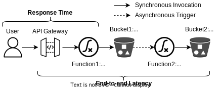
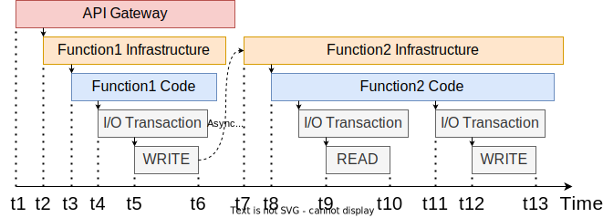

# Serverless CrossFit Replication Package

This repository contains the [code](./thumbnail-generator/), [data](./data/), and [data analysis](./data-analysis/) script of the CrossFit cross-provider serverless benchmark.
It also bundles a customized extension of the [serverless benchmarker](./serverless-benchmarker/) tool to automate and analyze serverless performance experiments.

## Application

A thumbnail generator is commonly used in web applications to resize images for responsive web design across multiple devices.
The thumbnail generator application consists of two chained functions connected through an asynchronous storage bucket trigger.
The life cycle of the application execution is as follow:

1. A user uploads the original image via an HTTP request to the API Gateway endpoint.
2. The API Gateway triggers *Function1* to persist the image.
3. *Function1* receives an image from the API Gateway and writes it to object storage into *Bucket1*.
4. Once the image is written to storage, *Function2* is triggered to process the image.
5. *Function2* resizes the image and writes a thumbnail to *Bucket2*.



## Dataset

The dataset of the paper is available in the `data` directory.
The `AWS` and `Azure` sub-directories contain data from benchmark executions from January 2022.

### Data Format

Each execution is a separate directory with a timestamp in the format `yyyy-mm-dd-HH-MM-SS` (e.g., `2022-01-06_10-38-44`) and contains the following files:

* `k6_metrics.csv`: Load generator HTTP client logs in CSV format (see [K6 docs](https://k6.io/docs/results-visualization/csv/))
* `sb_config.yml`: serverless benchmarker execution configuration including experiment label.
* `trace_breakdown.csv`: analyzer output CSV per trace. Contains the `trace_id`, all timestamps (`t1`-`t13`), and coldstart flags (`f1_cold_start=1|0`).
* `trace_ids.txt`: text file with each trace id on a new line.
* `traces.json`: raw trace JSON representation as retrieved from the provider tracing service. For AWS, see [X-Ray segment docs](https://docs.aws.amazon.com/xray/latest/devguide/xray-api-segmentdocuments.html). For Azure, see [Application Insights telemetry data model](https://docs.microsoft.com/en-us/azure/azure-monitor/app/data-model).
* `workload_options.json`: [K6 load scenario](https://k6.io/docs/using-k6/scenarios/) configuration.

### Execution Mappings

Summary of workload to execution mappings.
These are dynamically derived based on the benchmark metadata during data import.

```python
aws_executions = {
    'bursty_1': 'AWS/2022-01-06_13-38-16',
    'bursty_2': 'AWS/2022-01-06_17-02-45',
    'bursty_3': 'AWS/2022-01-06_18-53-29',
    'constant_1': 'AWS/2022-01-06_23-53-09',
    'constant_2': 'AWS/2022-01-06_12-00-34',
    'constant_3': 'AWS/2022-01-06_10-38-44',
}
azure_executions = {
    'bursty_1': 'Azure/2022-01-06_13-44-53',
    'bursty_2': 'Azure/2022-01-06_17-09-03',
    'bursty_3': 'Azure/2022-01-06_18-59-42',
    'constant_1': 'Azure/2022-01-07_00-48-24',
    'constant_2': 'Azure/2022-01-06_12-30-50',
    'constant_3': 'Azure/2022-01-06_10-49-01',
}
```

## Replicate Data Analysis

The Python script to generate the plots and the statistical summaries presented in the paper is available in the `data-analysis` directory.

1. Install [Python](https://www.python.org/downloads/) 3.10+
2. Install Python dependencies `pip install -r requirements.txt`
3. Run [plots.py](./data-analysis/plots.py)

By default, the plots will be saved into a `plots` sub-directory.
An alternative output directory can be configured through the environment variable `PLOTS_PATH`.

> Hint: For interactive development, we recommend the VSCode [Python extension](https://marketplace.visualstudio.com/items?itemName=ms-python.python) in [interactive mode](https://youtu.be/lwN4-W1WR84?t=107).

## Replicate Cloud Experiments

The following steps use ServiBench experiment plans to automate the benchmarking experiments with different workload types (constant and bursty) and collect a new dataset in the same data format as described above.

1. Follow the instructions in the [serverless-benchmarker/README](./serverless-benchmarker/README.md) to setup ServiBench for AWS and Azure.
2. Run the experiment plan via `python experiment_bursty_1.py` to automate invocation, trace retrieval, and trace analysis. The workloads used in the paper are:
    * `experiment_bursty_1.py`
    * `experiment_bursty_2.py`
    * `experiment_bursty_3.py`
    * `experiment_constant_3.py`

## Smoke Test Application

1. **Setup:** Follow the instructions in the [serverless-benchmarker/README](./serverless-benchmarker/README.md) to setup ServiBench for AWS and Azure.
2. **Deploy:** Deploy application into a cloud provider.

    ```bash
    cd AWS  # or cd Azure
    sb prepare
    ```

3. **Invoke:** Sequentially invoke 10 times.

    ```bash
    sb invoke 10
    ```

4. **Cleanup:** Delete all cloud resources.

    ```bash
    sb cleanup
    ```

## Instrumentation



### AWS

We enable AWS X-Ray tracing and augment out-of-the-box tracing with custom instrumentation using the AWS X-Ray .Net SDK to obtain the timestamps t3, t4, t8, and t11.

### Azure

Analogous to AWS, we add custom instrumentation using the Azure Application Insights C# SDKto obtain the same timestamps unavailable with out-of-the-box tracing. Unlike AWS X-Ray, Azure Application Insights lacks automated correlation of spans originating from different functions. We manually pass the trace id using object storage metadata between the two functions and add it as a custom property to the trace of Function2. We subsequently correlate the two distinct traces during analysis based on this traceability metadata. We acknowledge that adding metadata to object storage and traces adds a small overhead in Azure. However, trace correlation is necessary for comparable instrumentation and AWS implements a similar approach under the hood. If coldstart logs are missing, check that Azure Functions scale controller logs are enabled in the application settings via `SCALE_CONTROLLER_LOGGING_ENABLED` (see [Azure docs](https://docs.microsoft.com/en-us/azure/azure-functions/configure-monitoring?tabs=v2#configure-scale-controller-logs)).

## Credits

The .NET implementation of the thumbnail generator is based on the original Java implementation from the repository [iaas-splab/faas-migration](https://github.com/iaas-splab/faas-migration).
The application was proposed in the following study:

```none
Vladimir Yussupov, Uwe Breitenbücher, Frank Leymann, and Christian Müller. Facing the unplanned migration of serverless applications: A study on portability problems, solutions, and dead ends. In Proceedings of the 12th IEEE/ACM International Conference on Utility and Cloud Computing, pages 273–283, 2019.
```
