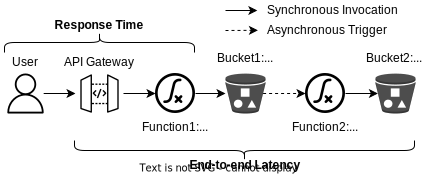

# Thumbnail Generator

A thumbnail generator is commonly used in web applications to resize images for responsive web design across multiple devices.
The thumbnail generator application consists of two chained functions connected through an asynchronous storage bucket trigger.
The life cycle of the application execution is as follow:

1. A user uploads the original image via an HTTP request to the API Gateway endpoint.
2. The API Gateway triggers *Function1* to persist the image.
3. *Function1* receives an image from the API Gateway and writes it to object storage into *Bucket1*.
4. Once the image is written to storage, *Function2* is triggered to process the image.
5. *Function2* resizes the image and writes a thumbnail to *Bucket2*.



## Setup

Follow the instructions in the [serverless-benchmarker/README](../serverless-benchmarker/README.md) to setup the serverless benchmarker for AWS and Azure.

## Deployment

```bash
cd AWS  # or cd Azure
sb prepare
```

## Invoke

```bash
sb invoke 10
```

## Cleanup

```bash
sb cleanup
```

## Credits

This .NET implementation is based on the original Java implementation from the repository [iaas-splab/faas-migration](https://github.com/iaas-splab/faas-migration).
The application was proposed in the following study:

```none
Vladimir Yussupov, Uwe Breitenbücher, Frank Leymann, and Christian Müller. Facing the unplanned migration of serverless applications: A study on portability problems, solutions, and dead ends. In Proceedings of the 12th IEEE/ACM International Conference on Utility and Cloud Computing, pages 273–283, 2019.
```
